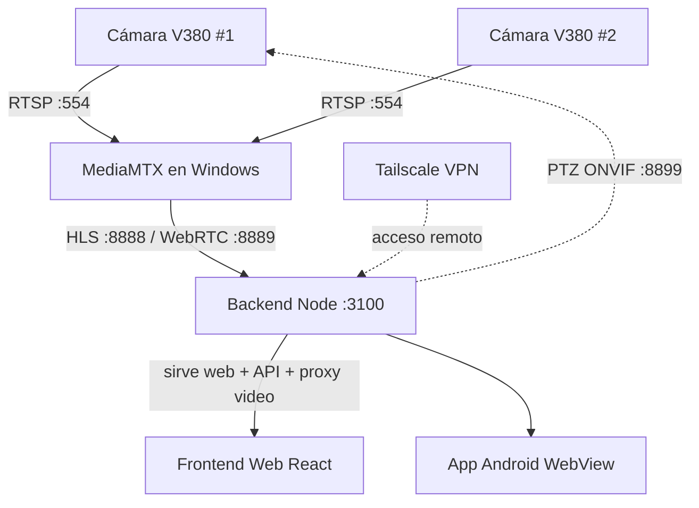

# 🎥 cuscam — Centro de Monitoreo de Cámaras V380

Sistema de videovigilancia para cámaras **V380 Pro** con visualización en tiempo
real desde el navegador (escritorio), una app Android, y acceso seguro desde
internet. Convierte el RTSP de las cámaras a **WebRTC** (latencia <1s) y **HLS**
(~1-2s) mediante MediaMTX, e incluye control **PTZ** (movimiento), cambio de
resolución **HD/SD** y más.

> Reescrito desde la idea original (React Native + WSL) a una arquitectura web
> servida por un backend Node sobre Windows nativo. Ver historial de cambios.

---

## ✨ Funcionalidades

- **Grid multi-cámara** en vivo (tema oscuro, responsivo).
- **Dos modos de transmisión** conmutables: **WebRTC** (tiempo casi real) y
  **HLS** (estable), con *fallback* automático de WebRTC a HLS.
- **Control PTZ** por ONVIF (mover la cámara: ▲◀▶▼) y **zoom digital** (＋/−).
- **Control por teclado** sobre la ventana activa: **flechas** = PAN/TILT,
  **TAB** = cambiar de cámara, **Ctrl + rueda** = zoom (también en la ampliada).
- **Cambio de calidad HD/SD** en caliente (720p ⇄ 360p) sin cortar las demás.
- **Reconexión automática**: si una cámara corta el stream, el reproductor se
  reengancha solo (con un indicador del nº de reconexiones por cámara).
- **Grabación continua 24/7** con retención configurable, **línea de tiempo tipo
  DVR** (con miniaturas al pasar el ratón) y **exportación de clips MP4** por rango.
- **Audio en vivo** vinculado a la ventana activa (exclusivo; por WebRTC).
- **Ventanas flotantes arrastrables** para todos los paneles/modales.
- **Doble click** en una cámara para verla **ampliada** en un modal.
- **Gestión de cámaras** desde la web: agregar, editar todas sus propiedades,
  credenciales RTSP, Wi-Fi (referencia), y ver **capacidades ONVIF** reales.
- **App Android** (WebView) que reusa toda la interfaz web.
- **Acceso remoto seguro** desde internet vía **Tailscale** (sin abrir puertos).

---

## 🏗️ Arquitectura



**Clave del diseño:** el backend (`:3100`) sirve **todo por un solo origen** — la
web, la API y el video (proxeando HLS y WebRTC de MediaMTX). Las URLs son
relativas, así la misma app funciona en `localhost`, en la LAN, y por la IP de
Tailscale sin cambios.

### Componentes

| Carpeta | Qué es |
|---|---|
| [`backend/`](backend/) | API Node/Express: cámaras, PTZ ONVIF, calidad HD/SD, capacidades, proxy HLS/WebRTC. |
| [`desktop/`](desktop/) | Frontend web (React + Vite + hls.js). Toda la UI. |
| [`server/`](server/) | MediaMTX, generador de config, scripts (firewall, arranque) y guía Tailscale. |
| [`android/`](android/) | App Android (WebView) lista para Android Studio. |
| [`config/`](config/) | `cameras.json` (fuente única de verdad). **No versionado** — ver `cameras.example.json`. |
| [`mobile/`](mobile/) | App React Native CLI inicial (alternativa histórica). |

---

## 🚀 Puesta en marcha

### Requisitos
- **Windows** con [Node.js 18+](https://nodejs.org).
- [MediaMTX](https://github.com/bluenviron/mediamtx/releases) para Windows
  (descomprimido en `mediamtx_v1.19.1_windows_amd64/`).
- Cámaras V380 con **RTSP/ONVIF activado** (desde la app oficial V380).
- *(Opcional)* [FFmpeg](https://www.gyan.dev/ffmpeg/builds/) en `tools/` — solo
  necesario para **exportar clips MP4**. Ver [`SETUP.md`](SETUP.md#ffmpeg-necesario-solo-para-exportar-clips).

### 1. Configurar las cámaras
Copia el ejemplo y edítalo con tus datos reales:
```bash
cp config/cameras.example.json config/cameras.json
```
Campos: `windowsHostIp`, `hlsPort`/`webrtcPort`, y por cámara `id`, `name`,
`rtsp` (con usuario/contraseña), `onvifPort`, `quality`.

### 2. Instalar dependencias y compilar el frontend
```bash
cd backend && npm install && cd ..
cd desktop && npm install && npm run build && cd ..
```

### 3. Arrancar todo
```powershell
# Regenera la config de MediaMTX, arranca MediaMTX y el backend, y verifica.
powershell -ExecutionPolicy Bypass -File .\start-all.ps1
```
Abre **http://localhost:3100**.

> Para que arranque solo al iniciar sesión en Windows, hay una **tarea
> programada** (`cuscam-autostart`). Si la borraste, vuelve a crearla apuntando
> a `start-all.ps1`.

---

## 🌐 Acceso desde internet (Tailscale)

Permite ver las cámaras desde cualquier red (datos móviles, otra ciudad) de forma
cifrada y **sin abrir puertos del router**. Guía completa:
[`server/TAILSCALE-SETUP.md`](server/TAILSCALE-SETUP.md).

Resumen: instala Tailscale en la PC y en el teléfono (misma cuenta), obtén la IP
`100.x.x.x` de la PC (`tailscale ip -4`), y accede a `http://100.x.x.x:3100`.
Tanto WebRTC como HLS funcionan por Tailscale.

---

## 📱 App Android

Proyecto WebView listo para compilar en Android Studio. Solo configura la URL
(`cuscam_url` en `android/app/src/main/res/values/strings.xml`) con tu IP de
Tailscale o LAN, y compila. Detalles: [`android/README.md`](android/README.md).

---

## 🔧 Acceso para LAN local (opcional)

Para ver desde otros dispositivos en tu red local sin Tailscale, abre los puertos
en el Firewall de Windows (requiere Administrador):
```powershell
powershell -ExecutionPolicy Bypass -File .\server\setup-firewall.ps1
```

---

## 🔒 Seguridad

- **Nunca** expongas los puertos de las cámaras (554/8888) directo a internet.
  Usa Tailscale (recomendado) o un túnel con autenticación.
- Asigna **IP estática / reserva DHCP** a cámaras y a la PC servidor.
- `config/cameras.json` y `server/mediamtx.yml` contienen credenciales y están
  **excluidos del repositorio** (`.gitignore`). No los subas.

---

## 🧩 Referencia rápida de la API (backend `:3100`)

| Método | Ruta | Descripción |
|---|---|---|
| GET | `/api/cameras` | Lista de cámaras con URLs de video. |
| POST | `/api/cameras` | Agregar cámara. |
| PUT | `/api/cameras/:id` | Editar todas las propiedades. |
| DELETE | `/api/cameras/:id` | Eliminar cámara. |
| PATCH | `/api/cameras/:id/credentials` | Actualizar usuario/clave RTSP. |
| PATCH | `/api/cameras/:id/wifi` | Guardar Wi-Fi de referencia. |
| GET | `/api/cameras/:id/full` | Propiedades con RTSP desglosado. |
| GET | `/api/cameras/:id/capabilities` | Capacidades ONVIF reales. |
| POST | `/api/cameras/:id/ptz` | Comando PTZ (mover/detener). |
| POST | `/api/cameras/:id/quality` | Cambiar HD/SD en caliente. |
| GET/PUT | `/api/recording/config` | Config de grabación (guardar reinicia MediaMTX). |
| GET | `/api/cameras/:id/recordings` | Lista de segmentos grabados. |
| GET | `/api/cameras/:id/timeline` | Línea de tiempo (segmentos con hora real). |
| GET | `/api/cameras/:id/recordings/:file` | Sirve un segmento (con Range / `?download=1`). |
| GET | `/api/cameras/:id/export` | Exporta un clip MP4 de `?from=&to=` (requiere FFmpeg). |
| GET | `/api/cameras/:id/frame` | Fotograma de previsualización en `?at=` (miniatura del timeline). |
| GET | `/api/cameras/:id/signal-events` | Historial de pérdidas/recuperaciones de señal (del log MediaMTX). |
| GET/PUT | `/api/network` | Config de red (host, puertos). |
| — | `/hls/*`, `/whep/*` | Proxy a MediaMTX (HLS y WebRTC). |
