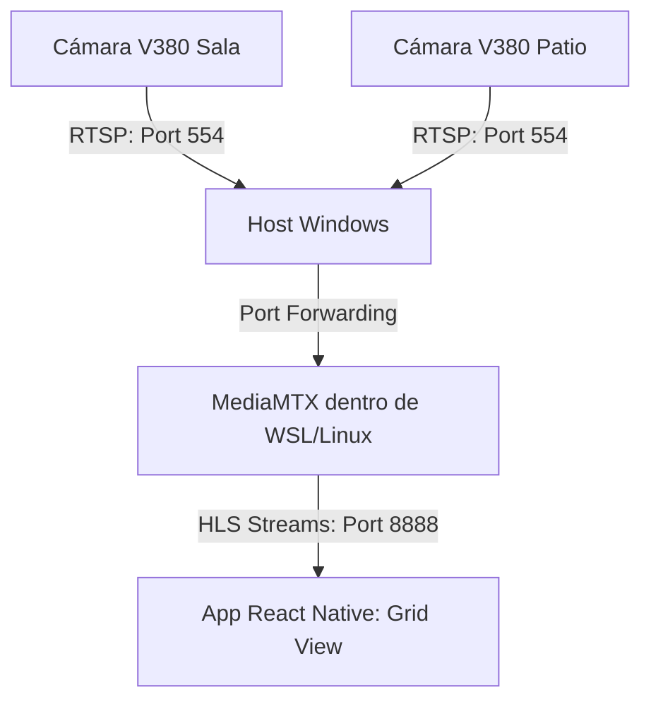

# 🏠 Home Cam App - Multi-V380 Streamer (Windows & WSL/Linux)

Aplicación móvil independiente desarrollada desde cero en React Native (JavaScript) para la visualización en tiempo real de múltiples cámaras de seguridad V380 Pro. El backend de streaming corre con el máximo rendimiento sobre Linux mediante WSL en un entorno Windows doméstico.

---

## 🛠️ Arquitectura de Red y Streaming

El sistema centraliza múltiples transmisiones de video locales convirtiendo el protocolo propietario/RTSP de las cámaras a un formato de baja latencia compatible con dispositivos móviles (HLS/WebRTC).



---

## 💻 Configuración del Servidor (Windows + WSL Linux)

Para obtener la máxima estabilidad en la gestión de video, el backend se ejecuta en un entorno Linux virtualizado nativamente dentro de Windows.

### 1. Habilitar Entorno Linux (WSL)
Abre PowerShell en Windows como **Administrador** y ejecuta:
```powershell
wsl --install
```
*Reinicia la computadora tras completar la instalación y configura tu usuario/contraseña de Ubuntu.*

### 2. Instalación de MediaMTX en la Terminal de WSL
Abre la terminal de Ubuntu (o selecciona el perfil WSL en la terminal de VS Code) y ejecuta los siguientes comandos:

```bash
# Actualizar los repositorios del sistema interno
sudo apt update && sudo apt upgrade -y

# Descargar la última versión de MediaMTX para Linux (AMD64)
wget https://github.com

# Descomprimir el binario y sus configuraciones
tar -xf mediamtx_v1.9.3_linux_amd64.tar.gz
```

### 3. Edición del Archivo de Configuración (`mediamtx.yml`)
Usa la extensión de VS Code **WSL** para abrir y modificar el archivo directamente desde el editor:
```bash
code mediamtx.yml
```
Dirígete a la sección final `paths:` y mapea los flujos RTSP locales de tus cámaras V380 (reemplaza las IPs por las reales de tus cámaras):

```yaml
paths:
  sala:
    source: rtsp://192.168.1.50:554/live/ch00_1
  patio:
    source: rtsp://192.168.1.51:554/live/ch00_1
```

### 4. Encender el Servidor
Para poner en marcha el transcodificador, ejecuta el binario en la terminal de Linux:
```bash
./mediamtx
```
*Nota de red:* Windows mapeará automáticamente el puerto `8888` de WSL hacia tu red local. Las URLs de salida para tu app móvil usarán la **IP privada de tu PC Windows** (Ejemplo: `http://192.168.1`).

---

## 🚀 Instrucciones para Asistentes de IA (VS Code AI Prompts)

*Usa estos prompts exactos en GitHub Copilot, Cursor, Cline o Roo Code para construir la aplicación:*

### Prompt 1: Creación del Entorno Móvil
> "Genera los comandos de terminal necesarios para crear un proyecto React Native usando Expo con JavaScript. Configura e instala la dependencia oficial `expo-video` (o `react-native-video` si elijo React Native CLI) encargada de reproducir flujos de streaming HLS en vivo."

### Prompt 2: Generación del Código del Tablero Multi-Cámara
> "Basándote en este archivo README, genera el archivo principal de código `App.js` para una aplicación móvil en React Native (JavaScript). Requisitos:
> 1. Define un arreglo de objetos llamado `CAMERAS_DATA` que contenga los nombres ('Sala Principal', 'Patio Trasero') y sus respectivas URLs de flujo HLS apuntando al puerto 8888 del MediaMTX.
> 2. Implementa una `FlatList` configurada con `numColumns={2}` para crear una cuadrícula simétrica.
> 3. Cada celda de video debe renderizarse con una relación de aspecto fija de 16:9 y debe mantenerse en modo silenciado (`muted={true}`) por defecto.
> 4. Agrega estados locales (`useState`) individuales para manejar un `ActivityIndicator` de carga por cada cámara de forma independiente.
> 5. Estiliza el diseño con un tema oscuro moderno de centro de control utilizando el color `#121212` de fondo."

---

## 📱 Código Base de la Aplicación (`App.js`)

Este código inicial expone el flujo lógico estructurado para renderizar la cuadrícula multi-cámara:

```javascript
import React, { useState } from 'react';
import { StyleSheet, Text, View, FlatList, ActivityIndicator, Dimensions } from 'react-native';
import Video from 'react-native-video'; // Intercambiable por 'expo-video'

const { width } = Dimensions.get('window');
const cellWidth = (width - 24) / 2; // Distribución dinámica de pantalla

// CONFIGURACIÓN: Reemplaza con la IP fija de tu PC Windows
const WINDOWS_HOST_IP = "192.168.1.15";

const CAMERAS_DATA = [
  { id: '1', name: 'Sala Principal', url: `http://${WINDOWS_HOST_IP}:8888/sala/index.m3u8` },
  { id: '2', name: 'Patio Trasero', url: `http://${WINDOWS_HOST_IP}:8888/patio/index.m3u8` },
];

function CameraCell({ item }) {
  const [isLoading, setIsLoading] = useState(true);

  return (
    <View style={styles.card}>
      <Text style={styles.cardTitle}>{item.name}</Text>
      <View style={styles.videoContainer}>
        <Video
          source={{ uri: item.url }}
          style={styles.video}
          resizeMode="contain"
          repeat={true}
          muted={true}
          onLoad={() => setIsLoading(false)}
          onError={(e) => console.log(`Fallo de conexión en ${item.name}: `, e)}
        />
        {isLoading && (
          <ActivityIndicator size="small" color="#007AFF" style={styles.loader} />
        )}
      </View>
    </View>
  );
}

export default function App() {
  return (
    <View style={styles.container}>
      <Text style={styles.mainTitle}>Centro de Monitoreo Residencial</Text>
      <FlatList
        data={CAMERAS_DATA}
        renderItem={({ item }) => <CameraCell item={item} />}
        keyExtractor={(item) => item.id}
        numColumns={2}
        contentContainerStyle={styles.grid}
      />
    </View>
  );
}

const styles = StyleSheet.create({
  container: {
    flex: 1,
    backgroundColor: '#121212',
    paddingTop: 50,
  },
  mainTitle: {
    fontSize: 18,
    fontWeight: '700',
    color: '#ffffff',
    textAlign: 'center',
    marginBottom: 16,
  },
  grid: {
    paddingHorizontal: 8,
  },
  card: {
    flex: 1,
    margin: 4,
    backgroundColor: '#1e1e1e',
    borderRadius: 8,
    padding: 8,
    alignItems: 'center',
  },
  cardTitle: {
    color: '#aaaaaa',
    fontSize: 13,
    fontWeight: '600',
    marginBottom: 6,
    alignSelf: 'flex-start',
  },
  videoContainer: {
    width: cellWidth - 16,
    height: (cellWidth - 16) * (9 / 16),
    backgroundColor: '#000000',
    borderRadius: 4,
    overflow: 'hidden',
    justifyContent: 'center',
  },
  video: {
    width: '100%',
    height: '100%',
  },
  loader: {
    position: 'absolute',
    alignSelf: 'center',
  },
});
```

---

## 🔒 Directrices de Seguridad y Red Doméstica
1. **IP Estática:** Se recomienda encarecidamente asignar una dirección IP estática (o reserva DHCP en tu Router) tanto a las cámaras V380 como a la PC Servidor Windows para evitar pérdidas de conexión al reiniciar el router.
2. **Acceso Seguro Remoto:** No realices redirección de puertos (Port Forwarding) expuestos a internet pública sobre el puerto `8888`. Implementa una red en malla privada usando **Tailscale** o instala un servidor **WireGuard** en tu máquina host para ver tus transmisiones fuera de casa de forma cifrada y segura.
